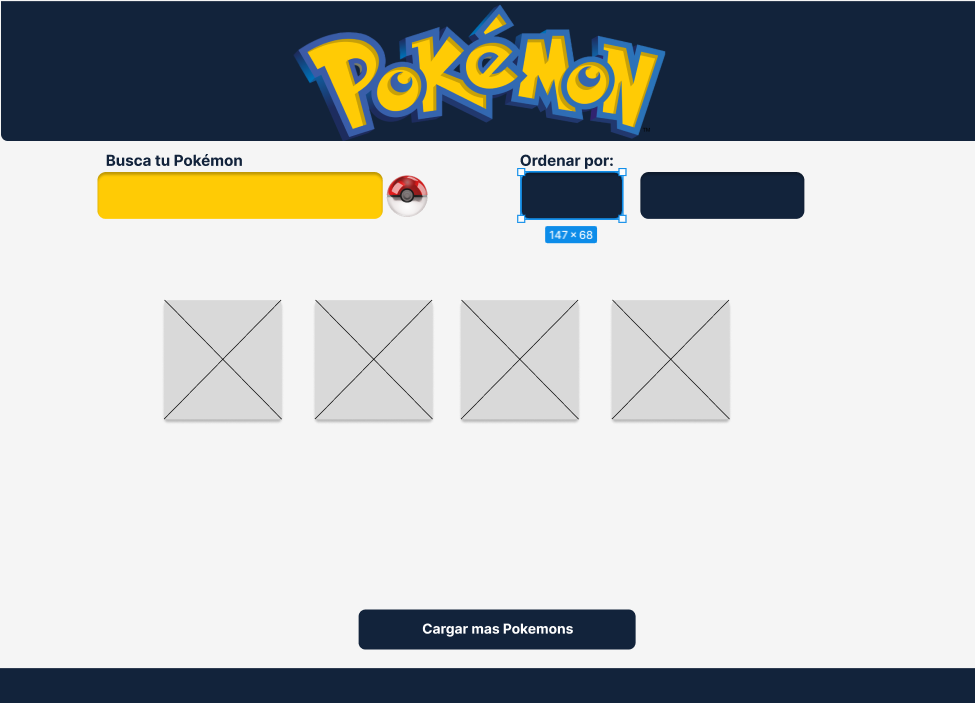
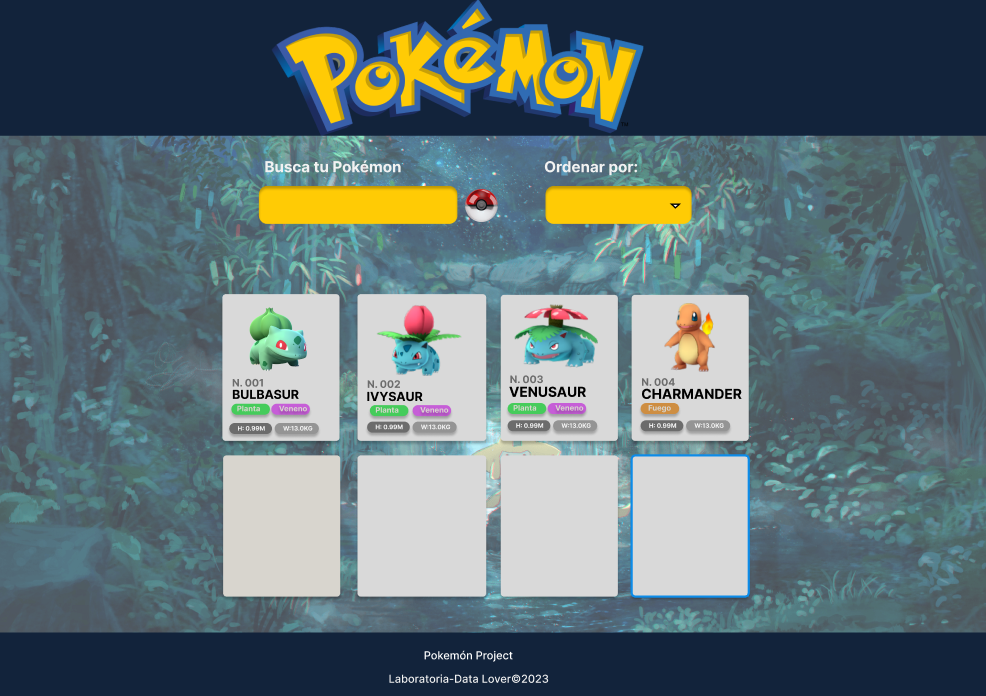
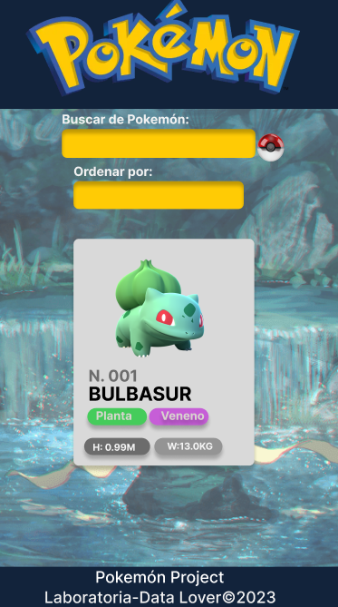
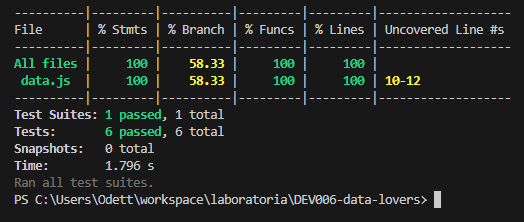

## DEFINICION DEL PRODUCTO✨

El presente producto tiene una interfaz diseñada e intuitiva donde le permitimos al usuario una búsqueda de fácil acceso mediante un buscador que filtra por nombre y un botón que ejecuta la búsqueda requerida.
La interfaz posee además, una lista despegable alfabética que nos permite ordenar de manera ascendente y descendente.
La pantalla muestra cards donde el usuario podrá visualizar: el número de orden de cada pokemón, nombre, tipo, peso y altura de cada pokemón.
La interfaz está diseñada para ser visualizada y manipulada en varios dispositivos, desde desktop hasta diferentes medidas de pantalla mobile.

## ORGANIZACION👩‍💻

Nos organizamos mediante la herramienta Trello.

Link adjunto:

https://trello.com/invite/b/HxtOxIpA/ATTIa03ae414962624bca2eabd37f69e25d17F5E9409/data-lovers-planning

## HISTORIA DE USUARIOS🕵️‍♀️

1.-Como usuario, quiero ver un encabezado con el logo de la Pokédex para identificar rápidamente el sitio web y su propósito.

2.- Como usuario, quiero ver una lista de todos los pokemón disponibles en la Pokédex para poder explorarlos y elegir uno para obtener más información.

3.-Como usuario, quiero ver una card con información sobre él, como su número, nombre, tipo, altura y peso.

4.-Como usuario, quiero tener fácil acceso a la búsqueda y al ordenamiento de pokemón

## PROTOTIPOS✍️

Prototipos de Baja y Alta Fidelidad creados en Figma.

Link adjunto de Figma:

https://www.figma.com/file/c1q6DbPGrSl4gX2XrgG0vS/ALTA-FIDELIDAD%2F-MOBILE-POKEMON?type=design&node-id=0%3A1&t=ZiasQqo9RTavRC9P-1

## TEST UNITARIOS🧾

Los test unitarios son un parte fundamental en nuestro proyecto para garantizar la calidad y estabilidad del código, permitiendome detectar y corregir errores de manera eficiente.

## CREDITOS 💅🏼

Laboratoria⭐

[Odett Pargas💁🏼‍♀️]

[Gabriela Pintado❤️]
